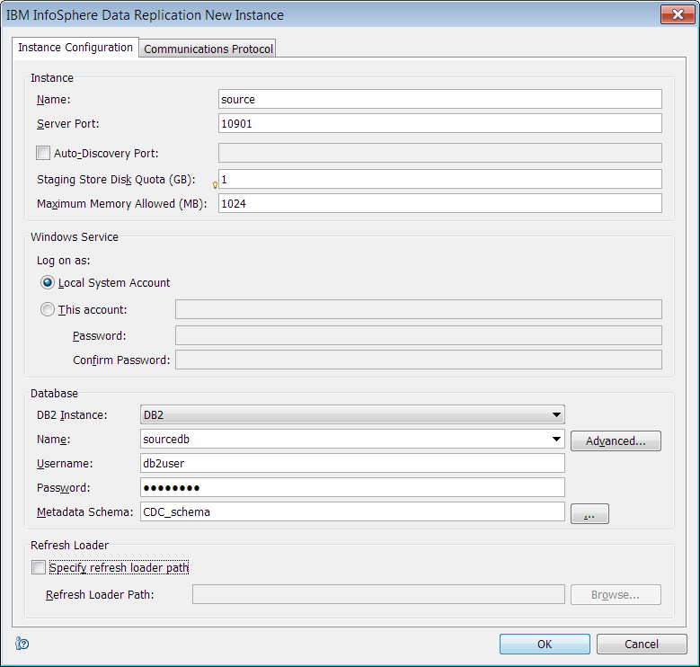
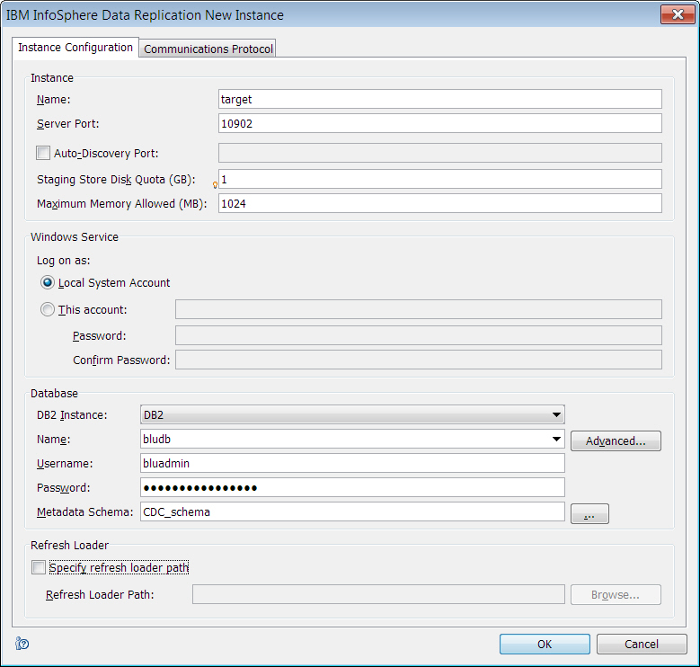
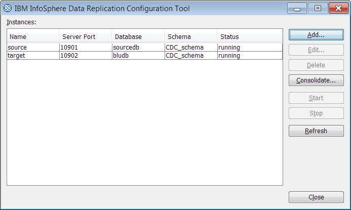
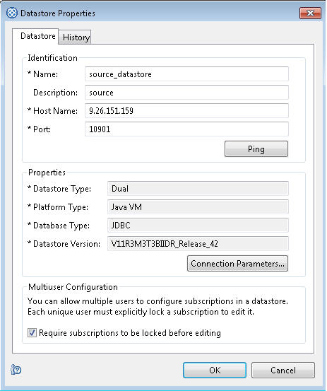
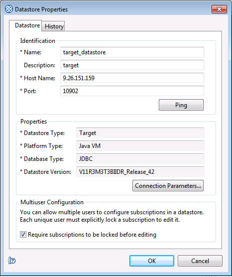
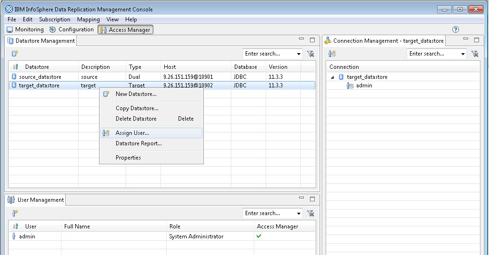

---

copyright:
  years: 2014, 2019
lastupdated: "2019-03-29"

keywords:

subcollection: Db2onCloud

---

<!-- Attribute definitions --> 
{:external: target="_blank" .external}
{:shortdesc: .shortdesc}
{:codeblock: .codeblock}
{:screen: .screen}
{:tip: .tip}
{:important: .important}
{:note: .note}
{:deprecated: .deprecated}
{:pre: .pre}

# Data integration
{: #data_int}

You can also connect external applications and tools to {{site.data.keyword.Db2_on_Cloud_short}} and use them to further manage or analyze your data. 
{: shortdesc}

## DataStage
{: #datastage}

These instructions explain how to define a connection without SSL between IBM® InfoSphere® DataStage® <!--version 9.1 and later -->and a {{site.data.keyword.Db2_on_Cloud_short}} database by cataloging the database and defining a connection object, or how to create a connection with SSL by using a digital certificate that is issued by a third party.
{: shortdesc}

### Prerequisites
{: #prereq1}

It is strongly advised that you update DataStage to the most recent version so that you can take advantage of external tables to load your data into {{site.data.keyword.Db2_on_Cloud_short}}.
{: important}

If you don’t already have a data server client installed, download and install the IBM Data Server Client <!--Version 10.5 -->that is appropriate for your client machine’s operating system: [IBM Data Server Client](https://www.ibm.com/marketing/iwm/iwm/web/preLogin.do?source=swg-idsc97){:external}.

To make connections with the SSL protocol, download and install the 32-bit GSKit V8. Click the OS tab that is appropriate for your client machine’s operating system: [GSKit V8 - Install, Uninstall and Upgrade instructions](http://www.ibm.com/support/docview.wss?uid=swg21631462){:external}. For the following operating systems, ensure that you add the GSKit installation directory path to the OS-specific path environment variable:

- AIX®: **LIBPATH**
   - `/usr/opt/ibm/gsk8/lib`
- Linux: **LD_LIBRARY_PATH**
    - `/usr/local/ibm/gsk8/lib`
- UNIX: **LD_LIBRARY_PATH**
    - `/opt/ibm/gsk8/lib`
- Windows: **PATH**
    - `<installation_directory>\gsk8\bin`
    - `<installation_directory>\gsk8\lib`

Before attempting to connect to your {{site.data.keyword.Db2_on_Cloud_short}} database, verify that you have the necessary [prerequisites](/docs/services/Db2onCloud/connecting?topic=Db2onCloud-connect_ov#prereqs).

### Procedure
{: #proc1}

- To create a connection with SSL, complete the following steps:

  1. Open a command line or terminal and make a new directory in the DataStage system to store the SSL certificate and key files.

     `# /home/db2inst2> mkdir SSL`

     `# /home/db2inst2> cd SSL`

  2. In the {{site.data.keyword.Db2_on_Cloud_short}} web console, download the SSL certificate from the **Connect your applications to the database** page.

     a. From the main menu, click **Connect**.
     
     b. Click **Connection with SSL**, and then click the **SSL certificate (1 KB)** link.
     
     c. Save the `DigiCertGlobalRootCA.crt` certificate into the SSL directory that you made in step 1.
        
  3. Create a client keystore database in the DataStage system by using the **gsk8capicmd_64** utility.

     `# /home/db2inst2/SSL> gsk8capicmd_64 -keydb -create -db <keystore_db.kdb> -pw <ks_db_password> -stash`

     where `<keystore_db.kdb>` represents the client keystore database and `<ks_db_password>` represents the password for the client keystore database.
        
  4. Add the certificate to the client keystore database.

     `# /home/db2inst2/SSL> gsk8capicmd_64 -cert -add -db <keystore_db.kdb> -pw <ks_db_password> -label BLUDB_SSL -file DigiCertGlobalRootCA.crt`

     where `<keystore_db.kdb>` represents the client keystore database and `<ks_db_password>` represents the password for the client keystore database.
    
  5. Configure the Db2 client on the DataStage server.
            
     a. Update the SSL configuration parameters in the database manager.

     `# /home/db2inst2> db2 update dbm cfg using SSL_CLNT_KEYDB /home/db2inst2/SSL/<keystore_db.kdb>`

     where `<keystore_db.kdb>` represents the client keystore database.

     `# /home/db2inst2> db2 update dbm cfg using SSL_CLNT_STASH /home/db2inst2/SSL/<keystore_db.sth>`

     where `<keystore_db.sth>` represents the client keystore database password stash.
            
     b. Catalog the target node with the SSL security option and then the BLUDB database at that target node.

     `# /home/db2inst2> db2 catalog tcpip node <node_name> remote <IP_addr_of_BLUDB_database_server> server 50001 security SSL`

     where `<node_name>` represents your name for the target node and `<IP_addr_of_BLUDB_database_server>` represents the IP address of the BLUDB database server,

     `# /home/db2inst2> db2 catalog db BLUDB as <db_alias> at node <node_name>`

     where `<db_alias>` is your name for the {{site.data.keyword.Db2_on_Cloud_short}} database.

  6. Add read and execute permissions on the files in the SSL directory for everyone. The DataStage user who runs the jobs needs to access these files to make SSL connections to the Db2 database.

     `# /home/db2inst2/SSL> chmod 655 /home/db2inst2/SSL/*`

  7. Test the SSL connection in one of the following ways:

     - Test the connection by using CLP. Issue the following command to connect to the {{site.data.keyword.Db2_on_Cloud_short}} database:

       `db2 connect to <db_alias> user <user_id>`

       where `<db_alias>` is your name for the {{site.data.keyword.Db2_on_Cloud_short}} database and `<user_id>` is your {{site.data.keyword.Db2_on_Cloud_short}} user ID. You are prompted to enter your password.
    
     - Test the connection by using CLI. Issue the following command to connect to the {{site.data.keyword.Db2_on_Cloud_short}} database:

       `db2cli validate -dsn <alias> -connect -user <user_id> -passwd <password>`

        where `<alias>` is an alias that you created by using the **db2cli writecfg** command, `<user_id>` is your {{site.data.keyword.Db2_on_Cloud_short}} user ID, and `<password>` is your {{site.data.keyword.Db2_on_Cloud_short}} password.

- To create a connection without SSL, catalog the target {{site.data.keyword.Db2_on_Cloud_short}} database by completing the following steps:

  1. Catalog the target {{site.data.keyword.Db2_on_Cloud_short}} node so that client applications can connect to it. Run the following CLP commands:

     `db2 catalog tcpip node <node_name> remote <IP_address_of_BLUDB_database_server> server <port_number_of_BLUDB_database>`

     where `<node_name>` represents your name for the node, `<IP_address_of_BLUDB_database_server>` represents the IP address of the BLUDB database server, and `<port_number_of_BLUDB_database>` represents the port number of the BLUDB database.

  2. Catalog the remote {{site.data.keyword.Db2_on_Cloud_short}} database so that client applications can connect to it. Run the following command:

     `db2 catalog db BLUDB as <db_alias> at node <node_name>`

     where `<db_alias>` represents your name for the {{site.data.keyword.Db2_on_Cloud_short}} database and `<node_name>` represents your name for the node.

  3. Test the non-SSL connection in one of the following ways:

      - Test the connection by using CLP. Issue the following command to connect to the {{site.data.keyword.Db2_on_Cloud_short}} database:

        `db2 connect to <db_alias> user <user_id>`

        where `<db_alias>` is your name for the {{site.data.keyword.Db2_on_Cloud_short}} database and `<user_id>` is your {{site.data.keyword.Db2_on_Cloud_short}} user ID. You are prompted to enter your password.

        `db2 list tables`

      - Test the connection by using CLI. Issue the following command to connect to the {{site.data.keyword.Db2_on_Cloud_short}} database:

        `db2cli validate -dsn <alias> -connect -user <user_id> -passwd <password>`

        where `<alias>` is an alias that you created by using the **db2cli writecfg** command, `<user_id>` is your {{site.data.keyword.Db2_on_Cloud_short}} user ID, and `<password>` is your {{site.data.keyword.Db2_on_Cloud_short}} password.

  4. Use the [connection information](/docs/services/Db2onCloud/connecting?topic=Db2onCloud-db_details_cxn_creds#db_details_cxn_creds) that you collected beforehand to define a connection in the DataStage client. On the **Parameters** tab, you must select the **DB2 Connector** for the **Connect using Staging Type** field.

     For details about defining a connection in DataStage, see the following DataStage documentation topics: 
     
     - [Creating a data connection object manually](https://www.ibm.com/support/knowledgecenter/SSZJPZ_11.3.0/com.ibm.swg.im.iis.ds.design.doc/topics/t_ddesref_Creating_a_Data_Connection_Object_Manually.html){:external}
     - [Configuring access to Db2 databases](https://www.ibm.com/support/knowledgecenter/en/SSZJPZ_11.7.0/com.ibm.swg.im.iis.conn.common.usage.doc/topics/t_configuring_db2conn.html){:external}

## Informatica
{: #informatica}

You can connect Informatica to {{site.data.keyword.Db2_on_Cloud_short}} to help you manage your data.
{: shortdesc}

Watch this video to see how to integrate {{site.data.keyword.Db2_on_Cloud_short}} with Informatica Cloud.

<iframe class="embed-responsive-item" id="youtubeplayer1" title="DB2 Connections - Lightening Fast How-To with Informatica Cloud" type="text/html" width="640" height="390" src="//www.youtube.com/embed/TUiS_HstLnU?rel=0" frameborder="0" webkitallowfullscreen mozallowfullscreen allowfullscreen> </iframe>

<!-- To configure a native Db2 connection to connect to {{site.data.keyword.Db2_on_Cloud_short}}, perform the following steps:

1. Run the `odbcad32.exe` file from your local system.
The ODBC Data Sources Administrator dialog box appears.

2. Create the 32-bit ODBC Data Source Name using the DataDirect Db2 drivers.

3. In the ODBC DB2 Wire Protocol Setup dialog box, click **Security** tab.

4. Set the value of the `Authentication Method` property as `1 -Encrypt Password`. The following image shows the **Security** tab in the ODBC DB2 Wire Protocol Setup dialog box where you can set the `Authentication Method` property:
             
   
       
5. In the ODBC DB2 Wire Protocol Setup dialog box, click **Modify Bindings** tab.

6. Enter your user name in the Package Collection property. The following image shows the **Modify Bindings** tab in the ODBC DB2 Wire Protocol Setup dialog box where you can set the `Package Collection` property: 

   
            
7. In the PowerCenter Designer, use the data source name that you created to import the metadata.

8. In the PowerCenter Workflow Manager, create the required workflow.

9. Ensure that you have the {{site.data.keyword.Db2_on_Cloud_short}} compatible 11.x Db2 clients when you run the workflow.

**Note**: If you want to set the authentication type when you create the Db2 client catalog, you could specify the value of the `AUTHENTICATION TYPE` property as `SERVER_ENCRYPT`. -->

<!-- Watch this video to see how to integrate Db2 and Salesforce with Informatica Cloud.

<iframe class="embed-responsive-item" id="youtubeplayer2" title="Integrate Db2 and Salesforce with Informatica Cloud" type="text/html" width="640" height="390" src="//www.youtube.com/watch?v=RGTLweZvKP8" frameborder="0" webkitallowfullscreen mozallowfullscreen allowfullscreen> </iframe> -->

<!-- [Informatica](https://kb.informatica.com/howto/6/Pages/20/522402.aspx?myk=Connect%20to%20Db2){:external} -->

## Lift
{: #lift}

Use Lift to migrate your data into {{site.data.keyword.Db2_on_Cloud_short}}.

[Lift](https://www.lift-cli.cloud.ibm.com/#docs){:external}

## InfoSphere Data Replication
{: #idr}

You can connect IBM® InfoSphere® Data Replication <!--version 11.3.3.3-36 or later -->to a {{site.data.keyword.Db2_on_Cloud_short}} database. This capability applies to both SMP and MPP environments. It does not apply to the Entry plan of {{site.data.keyword.Db2_on_Cloud_short}}. 
{: shortdesc}

### Overview
{: #overview2}

Ideally, when you connect IBM InfoSphere Data Replication to {{site.data.keyword.Db2_on_Cloud_short}}, IBM InfoSphere Data Replication is in the same {{site.data.keyword.Bluemix_notm}} Data Center as {{site.data.keyword.Db2_on_Cloud_short}} or is colocated with {{site.data.keyword.Db2_on_Cloud_short}}. IBM InfoSphere Data Replication connects from a local server to the remote {{site.data.keyword.Db2_on_Cloud_short}} instance.

When you use {{site.data.keyword.Db2_on_Cloud_short}} as a connection target, the performance of IBM InfoSphere Data Replication partly depends on the bandwidth of the network that separates its target engine from the {{site.data.keyword.Db2_on_Cloud_short}} instance. Physical distance also affects performance: ideally, IBM InfoSphere Data Replication is as close as possible to the {{site.data.keyword.Db2_on_Cloud_short}} instance. Network topology also affects performance. For example, ideally, the IBM InfoSphere Data Replication target engine runs on a VM in the same VPN (security domain) as the target instance. The fewer the network nodes (for example, firewalls or routers) to traverse, the better. 

### Prerequisites
{: #prereq2}

If you intend to connect by using the SSL protocol, download and install GSKit V8. See [GSKit V8 - Install, Uninstall and Upgrade instructions](http://www.ibm.com/support/docview.wss?uid=swg21631462){:external}. Click the operating system tab that applies to your client machine’s operating system. If you are installing the GSKit on a Windows computer, ensure that you specify the GSKit installation directory path (`<installation_directory>\gsk8\bin`) for the **`PATH`** environment variable.

Before attempting to connect to your {{site.data.keyword.Db2_on_Cloud_short}} database, verify that you have the necessary [prerequisites](/docs/services/Db2onCloud/connecting?topic=Db2onCloud-connect_ov#prereqs).

If you intend to connect by using the SSL protocol, download the `DigiCertGlobalRootCA.crt` SSL certificate from the web console to a directory on the client machine. To download the certificate, click **Connection > Connection Information** and then click the **Connection with SSL** tab.

### Procedure
{: #proc2}

1. Choose one of the following approaches to make your connection:

   - To create a connection with SSL, complete the following steps:
            
     a. Issue the following command:

     `cd /<ssl_directory_name>/ssl`

     where `/<ssl_directory_name>/ssl` is the path to the directory into which you downloaded the `DigiCertGlobalRootCA.crt` SSL certificate.

     b. Create a client key database and a stash file by using the **GSKCapiCmd** tool. For example, the following command creates a client key database called `dashclient.kdb` and a stash file called `dashclient.sth`:

     `gsk8capicmd_64 -keydb -create -db "dashclient.kdb" -pw "passw0rdpw0" -stash`

     where `passw0rdpw0` is a password. The **-stash** option creates a stash file in the same path as that of the client key database, with a file extension of `.sth`. At connection time, GSKit uses the stash file to obtain the password to the client key database.
            
     c. Add the certificate to the client key database. For example, the following **gsk8capicmd** command imports the certificate from the `/<ssl_directory_name>/ssl/DigiCertGlobalRootCA.crt` file into the client key database called `dashclient.kdb`:

     `gsk8capicmd_64 -cert -add -db "dashclient.kdb" -pw "passw0rdpw0" -label "DigiCert" -file "/<ssl_directory_name>/ssl/DigiCertGlobalRootCA.crt" -format ascii -fips`

     d. Update the values of the `SSL_CLNT_KEYDB` and `SSL_CLNT_STASH` database manager configuration parameters on the client to specify the client key database and the stash file. Examples follow:

     `db2 update dbm cfg using SSL_CLNT_KEYDB /<ssl_directory_name>/ssl/dashclient.kdb`

     `db2 update dbm cfg using SSL_CLNT_STASH /<ssl_directory_name>/ssl/dashclient.sth`

     e. Catalog the {{site.data.keyword.Db2_on_Cloud_short}} node so that client applications can connect to it. Issue the following command:

     `db2 catalog tcpip node <node_name> remote <Db2_Warehouse_IP_address> server <port_number> security ssl`

     where:
                
     `<node_name>` is your name for the node.

     `<Db2_Warehouse_IP_address>` is the IP address of the {{site.data.keyword.Db2_on_Cloud_short}} server.

     `<port_number>` is the port that is used to connect to {{site.data.keyword.Db2_on_Cloud_short}} by using an SSL connection. If you are using the default port, specify `50001`.
            
     f. Catalog the remote {{site.data.keyword.Db2_on_Cloud_short}} database so that client applications can connect to it. Issue the following command:

     `db2 catalog database bludb as <db_alias> at node <node_name>`

     where `db_alias` is your name for the {{site.data.keyword.Db2_on_Cloud_short}} database.
            
     g. Test the SSL connection in one of the following ways:
                
     - Test the connection using CLP by issuing the following command to connect to the {{site.data.keyword.Db2_on_Cloud_short}} database:

       `db2 connect to <db_alias> user <user_id>`

       where `<user_id>` is your {{site.data.keyword.Db2_on_Cloud_short}} user ID. You are prompted to enter your password.
                
     - Test the connection using CLI by issuing the following command to connect to the {{site.data.keyword.Db2_on_Cloud_short}} database:

       `db2cli validate -dsn <alias> -connect -user <user_id> -passwd <password>`

       where `<alias>` is a DSN alias that you created by using the **db2cli writecfg** command, `<user_id>` is your {{site.data.keyword.Db2_on_Cloud_short}} user ID, and `<password>` is your {{site.data.keyword.Db2_on_Cloud_short}} database password.
        
   - To create a connection without SSL, complete the following steps:

     a. Catalog the {{site.data.keyword.Db2_on_Cloud_short}} node so that client applications can connect to it. Issue the following command:

     `db2 catalog tcpip node <node_name> remote <Db2_Warehouse_IP_address> server <port_number>`

     where:
                
     `<node_name>` is your name for the node.

     `<Db2_Warehouse_IP_address>` is the IP address of the {{site.data.keyword.Db2_on_Cloud_short}} server.

     `<port_number>` is the port that is used to connect to {{site.data.keyword.Db2_on_Cloud_short}} without using an SSL connection. If you are using the default port, specify `50000`.
            
     b. Catalog the remote {{site.data.keyword.Db2_on_Cloud_short}} database so that client applications can connect to it. Issue the following command:

     `db2 catalog database bludb as <db_alias> at node <node_name>`

     where `<db_alias>` is your name for the {{site.data.keyword.Db2_on_Cloud_short}} database.

     c. Test the non-SSL connection in one of the following ways:

     - Test the connection using CLP by issuing the following command to connect to the {{site.data.keyword.Db2_on_Cloud_short}} database:

       `db2 connect to <db_alias> user <user_id>`

       where `<user_id>` is your {{site.data.keyword.Db2_on_Cloud_short}} user ID. You are prompted to enter your password.
                
     - Test the connection using CLI by issuing the following command to connect to the {{site.data.keyword.Db2_on_Cloud_short}} database:

       `db2cli validate -dsn <alias> -connect -user <user_id> -passwd <password>`

       where `<alias>` is a DSN alias that you created by using the **db2cli writecfg** command, `<user_id>` is your {{site.data.keyword.Db2_on_Cloud_short}} user ID, and `<password>` is your {{site.data.keyword.Db2_on_Cloud_short}} password.
    
2. Launch the InfoSphere Data Replication configuration tool and perform the following steps. The values that are shown in the screen captures are examples.
        
   a. Add a source instance to point to your source database by using the **Instance Configuration** tab:

   {: caption="Figure 1. IIDR New Instance - Source instance" caption-side="bottom"}

   b. Add a target instance to point to your target Db2 database by using the **Instance Configuration** tab. If you are not using IBM InfoSphere Data Replication 11.3.3.3-50 or later, do not select the **Specify refresh loader path** check box.

   {: caption="Figure 2. IIDR New Instance - Target instance" caption-side="bottom"}

   c. Start each instance:

   {: caption="Figure 3. IIDR Configuration Tool" caption-side="bottom"}

3. Launch the InfoSphere Data Replication management console and use Access Manager to complete the following steps:
        
   a. Create a datastore to connect to your source instance by using the **Datastore** tab. Because a Db2 database was not originally supported as a source database, you must provide user and password information for the source database by clicking **Connection Parameters**.

   {: caption="Figure 4. View of source datastore properties" caption-side="bottom"}

   b. Create a datastore to connect to your target instance by using the **Datastore** tab. You must provide user and password information by clicking **Connection Parameters**.

   {: caption="Figure 5. View of target datastore properties" caption-side="bottom"}

   c. If the user (for example, admin) that will connect to the Access Server does not exist, create that user:

   {: caption="Figure 6. View of New User creation tool" caption-side="bottom"}

   d. Click the **Access Manager** tab.
        
   e. On the **Datastore Management** tab, assign the user to both the source and target datastores by right-clicking each datastore and then clicking **Assign User**. Ensure that the credentials for accessing each instance are correct.

   {: caption="Figure 7. IIDR Management Console - Access Manager" caption-side="bottom"}

### What to do next
{: #what2}

Define a subscription and perform data replication. For information, see:

- [Loading data from InfoSphere Data Replication](https://www.ibm.com/support/knowledgecenter/SS6NHC/com.ibm.swg.im.dashdb.doc/learn_how/loaddata_iidr.html){:external} 

## Segment
{: #segment}

You can integrate Segment with a {{site.data.keyword.Db2_on_Cloud_short}} database. Segment is a single platform that collects, stores, and routes your user data to hundreds of tools.
{: shortdesc}

[Segment](https://segment.com/docs/destinations/db2/){:external}

## Data Studio
{: #data_studio}

These instructions explain how to create a connection from IBM® Data Studio <!--version 4.1.x -->to a {{site.data.keyword.Db2_on_Cloud_short}} database.
{: shortdesc}

### Prerequisites
{: #prereq3}

Before attempting to connect to your {{site.data.keyword.Db2_on_Cloud_short}} database, verify that you have the necessary [prerequisites](/docs/services/Db2onCloud/connecting?topic=Db2onCloud-connect_ov#prereqs).

### Procedure
{: #proc3}

1. In Data Studio, click **All Databases > New Connection to a database**.

2. On the **Local** tab, select **DB2 for Linux, UNIX, and Windows** as the database manager.
    
3. On the **General** tab, enter the following values:
   - *Database*: `BLUDB`
   - *Host*: The host name.
   - *Port*: For a connection without SSL, enter `50000`. For a connection with SSL, enter `50001`. 
   - *User name*: The user name that you use to log in.
   - *Password*: The password that you use to log in.

4. For an SSL connection, click the **Optional** tab, and then click **Add**. For the `sslConnection` property, specify `true`.

5. [*Optional*]: Click **Test Connection** to verify that the connection succeeded.

## Data Server Manager (DSM)
{: #dsm}

A connection between your IBM® Data Server Manager and your {{site.data.keyword.Db2_on_Cloud_short}} database enables you to monitor and manage the database from the Data Server Manager web console. 
{: shortdesc}

### Prerequisites
{: #prereq4}

Before attempting to connect to your {{site.data.keyword.Db2_on_Cloud_short}} database, verify that you have the necessary [prerequisites](/docs/services/Db2onCloud/connecting?topic=Db2onCloud-connect_ov#prereqs).

### Procedure
{: #proc4}

<!--The connection procedure was tested on Data Server Manager version 1.1. The same procedure applies to all of the other versions of the Data Server Manager software.
-->
To create a connection, complete the following steps:

1. Log in to your Data Server Manager web console.
    
2. In the Data Server Manager web console, go to **Set Up > Database Connections**.
    
3. Click the  icon to add a database connection. On the **Add Database Connection** page under the **Database Connection** tab, enter the required information in the following fields:

   - *Database connection name*: The name must be unique to Data Server Manager
   - *Data server type*: From the drop-down menu, select **DB2 for Linux, UNIX, and Windows**
   - *Database name*: `BLUDB`
   - *Host name*: Enter the {{site.data.keyword.Db2_on_Cloud_short}} host name 
   - *Port number*: For a connection without SSL, enter `50000`. For a connection with SSL, enter `50001`. 
   - *JDBC security*: From the drop-down menu, select **Clear text password**
   - *User ID*: Your {{site.data.keyword.Db2_on_Cloud_short}} user ID 
   - *Password*: Your {{site.data.keyword.Db2_on_Cloud_short}} password 

4. For a connection with SSL, select the **Advanced JDBC Properties** tab. Enter the required information in the following fields:

   - *Property*: `sslConnection`
   - *Value*: `true`

    Click the **Add** button. Select the **Database Connection** tab.
    
5. Test the connection by clicking the **Test Connection** button. If the connection is successful, click **OK**.

## InfoSphere Data Architect
{: #ida}

These instructions explain how to create a connection from InfoSphere® Data Architect <!--version 9.1.x -->to a {{site.data.keyword.Db2_on_Cloud_short}} database.
{: shortdesc}

### Prerequisites
{: #prereq5}

Before attempting to connect to your {{site.data.keyword.Db2_on_Cloud_short}} database, verify that you have the necessary [prerequisites](/docs/services/Db2onCloud/connecting?topic=Db2onCloud-connect_ov#prereqs).

### Procedure
{: #proc5}

1. In the Data Source Explorer view of InfoSphere Data Architect, right-click **Database Connections**, then select **New**.
    
2. On the **Local** tab, select **DB2 for Linux, UNIX, and Windows** as the database manager.
    
3. On the **General** tab, enter the following values:

   - *Database*: `BLUDB`
   - *Host*: The host name that you collected beforehand.
   - *Port*: For a connection without SSL, enter `50000`. For a connection with SSL, enter `50001`. 
   - *User name*: The user ID that you collected beforehand.
   - *Password*: The password that you collected beforehand.

4. For an SSL connection, click the **Optional** tab. Enter an `sslConnection` property and specify a value of `true`. Click **Add**.
    
5. [*Optional*]: Click **Test Connection** to verify that the connection succeeded.

## Aginity Workbench
{: #aginity_wb}

These instructions explain how to connect Aginity Workbench <!--4.3 -->to a {{site.data.keyword.Db2_on_Cloud_short}} database. You can use Aginity Workbench to migrate IBM PureData for Analytics (Netezza) data models and data to {{site.data.keyword.Db2_on_Cloud_short}}.
{: shortdesc}

### Prerequisites
{: #prereq6}

Before attempting to connect to your {{site.data.keyword.Db2_on_Cloud_short}} database, verify that you have the necessary [prerequisites](/docs/services/Db2onCloud/connecting?topic=Db2onCloud-connect_ov#prereqs).

### Procedure
{: #proc6}

1. Download and install Aginity Workbench.

2. Determine your ODBC DSN from the connection information that you noted earlier.

3. Launch Aginity Workbench. If the database connection dialog box does not open automatically, open it by clicking **Connect** on the toolbar.

4. [Establish a database connection](https://www.aginity.com/documentation/WB/dashDB/Default.htm#Aginity_Topics/Aginity_Workbench/Database_Connection_Dialog_Box.htm){:external}. Use the host name, user ID, and password from the connection information that you noted earlier.

## CLPPlus
{: #clpplus}

Command line processor plus (CLPPlus) is included in the Db2 driver package. CLPPlus provides a command-line interface that you can use to connect to a {{site.data.keyword.Db2_on_Cloud_short}} database. You can use CLPPlus to define, edit, and run statements, scripts, and commands.
{: shortdesc}

### Prerequisites
{: #prereq7}

Before attempting to connect to your {{site.data.keyword.Db2_on_Cloud_short}} database, verify that you have the necessary [prerequisites](/docs/services/Db2onCloud/connecting?topic=Db2onCloud-connect_ov#prereqs).

To use CLPPlus, ensure that a software development kit (SDK) or a Java runtime environment (JRE) for Java Version 1.5.0 or later is installed on your computer and that environment variables are set as follows:

- The `JAVA_HOME` environment variable is set to the Java installation directory on your computer.
- The `PATH` environment variable setting includes the `bin` subdirectory of the Java installation directory on your computer.

### Procedure
{: #proc7}

1. In a command shell on Linux operating systems, at the Windows command prompt, or in the DB2 command window on Windows operating systems, run the following commands:

   These commands create new entries in the driver configuration file (`db2dsdriver.cfg`) on your computer and set the connection attributes. You need to do this step only one time.

   - For a connection with SSL:

     `db2cli writecfg add -database BLUDB -host <hostname> -port 50001 -parameter "SecurityTransportMode=SSL"`

     `db2cli writecfg add -dsn <alias> -database BLUDB -host <hostname> -port 50001`  

     where:
     
     - `<hostname>` is the host name of the server.
     - `<alias>` is an alias that you choose.

   - For a connection without SSL:

     `db2cli writecfg add -database BLUDB -host <hostname> -port 50000`

     `db2cli writecfg add -dsn <alias> -database BLUDB -host <hostname> -port 50000`

2. To start CLPPlus with a connection to a {{site.data.keyword.Db2_on_Cloud_short}} database that uses the entries in the `db2dsdriver.cfg` file, run the following command:

   - Windows environments: 

     `clpplus <userid>@<alias>`

   - Linux environments:

     `clpplus -nw <userid>@<alias>`

     where:
     
     - `<userid>` is the user ID from the connect credentials you collected beforehand.
     - `<alias>` is the alias that you created with the **db2cli writecfg** command.

   Running this command opens a CLPPlus window.

3. In the CLPPlus window, enter your password. The database information is displayed, followed by an SQL prompt. Sample output follows:

```
   Hostname = 192.0.2.0
   Database server = DB2/LINUXX8664  SQL10054
   SQL authorization ID = smith
   Local database alias = BLUDB
   Port = 50001
   
   SQL>
```

### Results
{: #results7}

You can now enter CLPPlus commands or SELECT statements and run scripts to work with the data in the database.

### Examples

The following examples use a short script that retrieves rows from the sample table `GOSALES.BRANCH`. The script file is named `cities.sql` and is on the local Windows computer in the `C:\temp directory`. The `cities.sql` file contains the following text:

```
SET ECHO ON
SELECT branch_code, city from GOSALES.BRANCH;
```

#### Example 1 

To run the script interactively:

1. Start CLPPlus with your user ID and the alias that you created in the `db2dsdriver.cfg` file by running the following command:

   `clpplus <user_id>@<alias>`
2. Enter your password.
3. At the SQL prompt, enter the following text:

   `start C:\temp\cities.sql`

#### Example 2

Start CLPPlus with your user ID and the alias that you created in the `db2dsdriver.cfg` file and run the script in one step:

`clpplus <user_id>/<password>@<alias> @C:\temp\cities.sql`

Sample output from the `cities.sql` script follows:

```
BRANCH_CODE CITY
----------- --------------------------------------------------
          6 Paris
          7 Milano
          9 Amsterdam
         13 Hamburg
         14 München
         15 Kista
         17 Calgary
         18 Toronto
         19 Boston
         20 Seattle
         21 Los Angeles
         22 Miami
         23 Lyon
         24 Distrito Federal
         25 Tokyo
         26 Osaka City
         28 Melbourne
         29 Bilbao
         30 Sao Paulo
         31 Kuopio
         32 Seoul
         33 Singapore

BRANCH_CODE CITY
----------- --------------------------------------------------
         34 Shanghai
         35 London
         36 Birmingham
         37 Zürich
         38 Heverlee
         39 Wien
         40 Geneve

29 rows were retrieved.
```


