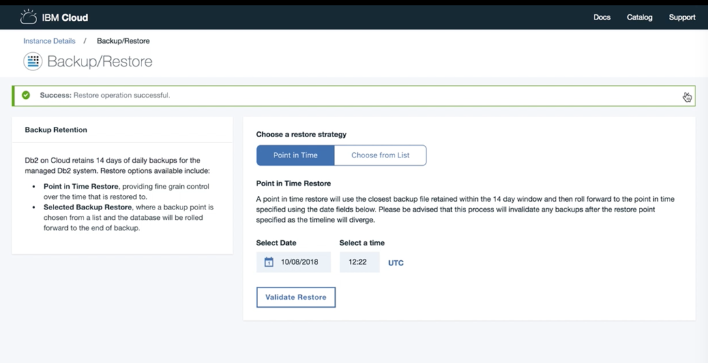

---

copyright:
  years: 2014, 2019
lastupdated: "2019-01-02"

keywords: 

subcollection: Db2onCloud

---

<!-- Attribute definitions --> 
{:external: target="_blank" .external}
{:shortdesc: .shortdesc}
{:codeblock: .codeblock}
{:screen: .screen}
{:tip: .tip}
{:important: .important}
{:note: .note}
{:deprecated: .deprecated}
{:pre: .pre}

# バックアップとリストア
{: #bnr}

有料プランでは、データベースの暗号化されたバックアップが毎日行われます。 毎日のバックアップは、過去 14 日間にわたって保持されます。
{: shortdesc}

標準バックアップに加え、[タイム・トラベル照会](https://developer.ibm.com/answers/questions/426878/how-do-i-use-time-travel-query-in-db2-or-db2-on-cl.html){:external}を使用して、古いデータのインスタント照会や簡易監査などの他の目的のために履歴データを保持することもできます。IBM Data Studio または任意の Db2 ツールを使用して、独自のエクスポートを実行することもできます。
 
ポイント・イン・タイム・リストアについては、[ポイント・イン・タイム・リストア](#point-in-time)を参照してください。

すべての有料プランでは通常、IBM Cloud Object Storage (COS) を利用して、オフサイトの 3 つの異なるデータ・センターでバックアップが保持されます。 ただし、現時点では、シドニー・データ・センターと小規模なデータ・センターの一部は、IBM COS によるオフサイト・レプリケーションをサポートしていません。 オフサイト・レプリケーションをサポートしている地域を判別するには、お客様の地域の [IBM COS の資料](/docs/services/cloud-object-storage/basics?topic=cloud-object-storage-endpoints#endpoints)を確認してください。

また、[IBM Lift CLI](https://www.lift-cli.cloud.ibm.com/){:external} を使用して、データを {{site.data.keyword.Db2_on_Cloud_short}} にインポートすることもできます。

## ポイント・イン・タイム・リストア
{: #point-in-time}

{{site.data.keyword.Db2_on_Cloud_short}} にポイント・イン・タイム・リストア機能が追加されました。 バックアップから正確なポイント・イン・タイムにリストアできます。 現在、ほとんどのお客様はこのフィーチャーをアクティブにするようサポートに要求する必要があります。 次のロールアウト・スケジュールを参照してください。

以下は、ポイント・イン・タイム・リストア・フィーチャーのアベイラビリティー・リストです。
- ダラス・データ・センター: 単一サーバー・システム上で現在使用可能です
- その他のすべてのケース (ヨーロッパ、およびダラスの HA システムを含む): サポートにフィーチャー・アクティブ化を要求してください。 すべてのシステムへのフルロールアウトは、2019 年 2 月 28 日までに完了する予定です。
- IBM Cloud Dedicated システム: サポート・チケットを開くことによってのみ使用可能です。

Web コンソール UI の特定の例を以下に示します。このスクリーン・ショットでは、ポイント・イン・タイム・リストア操作が開始されていて、その進行状況が示されています。

1. **ポイント・イン・タイム**・リストア戦略を選択し、データベースをリストアするターゲットのポイント・イン・タイム日付を選択します。 ポイント・イン・タイム・リストア・プロセスは、過去 14 日間に行われた保存バックアップのプールの中から、要求されたポイント・イン・タイム日付に最も近いバックアップを選択します。 

   ポイント・イン・タイム・リストア・プロセスは、選択されたポイント・イン・タイム日付よりも後の日付で保存されている過去のバックアップをすべて無効にします。リストアの結果として時系列に相違が生じるためです。
   {: note}

   

2. 選択したリストアを続行することを確認します。 リストア操作を開始したら、要求を変更することはできません。  

3. リストア・プロセスの初期化中です。

4. 選択されたポイント・イン・タイムにデータベースをリストアしています。

5. 新しいバックアップ・ポイントが作成されています。 ポイント・イン・タイム・リストア・データベースを使用できる状態になりました。

6. リストア操作が正常に完了しました。

