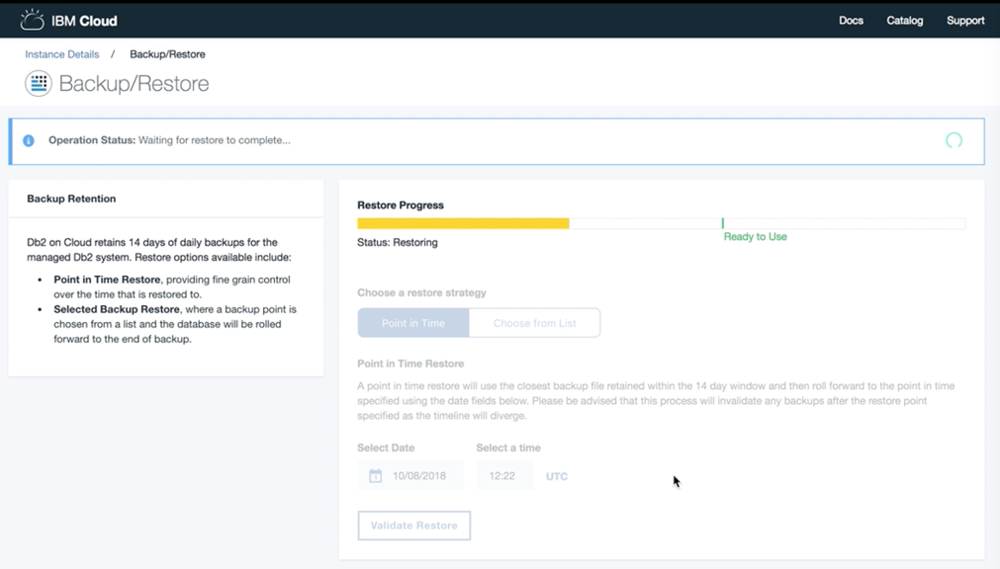

---

copyright:
  years: 2014, 2019
lastupdated: "2019-01-02"

keywords: 

subcollection: Db2onCloud

---

<!-- Attribute definitions --> 
{:new_window: target="_blank"}
{:shortdesc: .shortdesc}
{:codeblock: .codeblock}
{:screen: .screen}
{:tip: .tip}
{:important: .important}
{:note: .note}
{:deprecated: .deprecated}
{:pre: .pre}

# Backup e restauração
{: #bnr}

Para planos pagos, backups criptografados do banco de dados são feitos diariamente. Um backup diário é mantido para cada um dos últimos 14 dias.
{: shortdesc}

Além dos backups padrão, é possível usar a [Time Travel Query ](https://developer.ibm.com/answers/questions/426878/how-do-i-use-time-travel-query-in-db2-or-db2-on-cl.html){:new_window} para manter dados históricos para outros propósitos, como para consultar instantaneamente dados antigos ou para auditoria simplificada. Também é possível executar suas próprias exportações usando o IBM Data Studio ou qualquer ferramenta do Db2.
 
Para obter informações sobre restaurações point-in-time, consulte [Restauração point-in-time](#point-in-time).

Todos os planos pagos geralmente fazem uso do IBM Cloud Object Storage (COS) para manter os backups externos em três diferentes data centers. No entanto, Sydney e determinados data centers menores podem não suportar a replicação externa com o IBM COS neste momento. Consulte a [Documentação do IBM COS](/docs/services/cloud-object-storage/basics/endpoints.html#select-regions-and-endpoints) da sua região para determinar quais regiões suportam replicação externa.

<!-- Retained backups are used by IBM for system recovery purposes in the event of a disaster or system loss. Use the [Time Travel Query ](https://developer.ibm.com/answers/questions/426878/how-do-i-use-time-travel-query-in-db2-or-db2-on-cl.html){:new_window} to keep historical data for your own purposes. In addition, you can also perform your own exports using IBM Data Studio or any Db2 tool. -->

<!-- To store your backups offsite at a remote storage site, make a request to IBM Support. -->

Também é possível usar a [CLI do IBM Lift ](https://lift.ng.bluemix.net/){:new_window} para importar dados no {{site.data.keyword.Db2_on_Cloud_short}}.

## Restauração point-in-time
{: #point-in-time}

O {{site.data.keyword.Db2_on_Cloud_short}} incluiu um recurso de restauração point-in-time. É possível restaurar para um momento exato por meio de seus backups. Atualmente, para a maioria dos clientes, deve-se solicitar suporte para ativar esse recurso. Consulte o planejamento de lançamento a seguir.

A seguir está uma lista de disponibilidade do recurso de restauração point-in-time:
- Data center de Dallas: disponível hoje em sistemas de servidor único
- Todos os outros casos, incluindo sistemas de alta disponibilidade e da Europa em Dallas: solicitar ao suporte a ativação do recurso. O lançamento integral para todos os sistemas será concluído até 28 de fevereiro de 2019.
- Sistema IBM Cloud Dedicated (anteriormente Bluemix Dedicated): disponível apenas abrindo um chamado de suporte.

A seguir está um exemplo selecionado de capturas de tela da IU do console da web no qual a operação de restauração point-in-time é iniciada e seu progresso é indicado:

1. Selecione a estratégia de restauração **Point-in-time** e selecione uma data específica para a qual deseja restaurar o banco de dados. O processo de restauração point-in-time seleciona o backup mais próximo à data específica solicitada do conjunto de backups retidos feitos durante os 14 dias anteriores. 

   O processo de restauração point-in-time invalida qualquer backup retido anteriormente com datas após a data específica selecionada devido a uma divergência resultante na linha de tempo.
   {: note}

   

2. Confirme que você deseja continuar com as suas seleções de restauração. Depois de iniciar a operação de restauração, não é possível mudar a solicitação.  

3. O processo de restauração está inicializando.

4. Restaurando o banco de dados para o momento selecionado.

5. Um novo ponto de backup está sendo criado. O banco de dados restaurado para o momento está pronto para uso.

6. A operação de restauração foi concluída com êxito.

