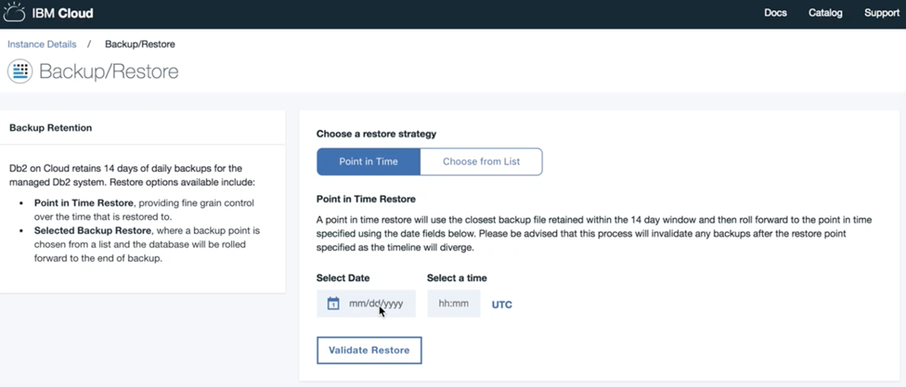
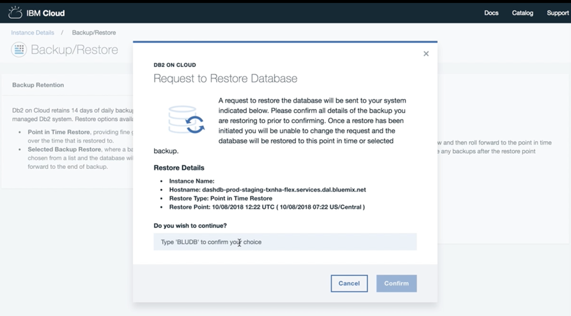
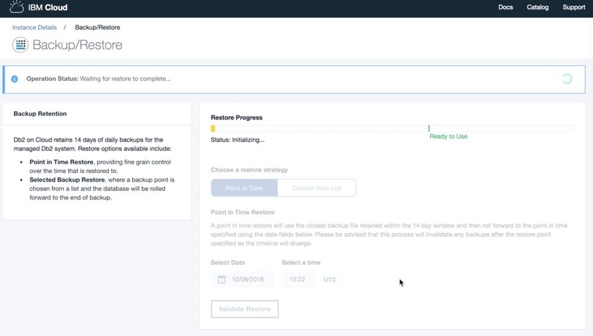

---

copyright:
  years: 2014, 2019
lastupdated: "2019-01-02"

keywords: 

subcollection: Db2onCloud

---

<!-- Attribute definitions --> 
{:new_window: target="_blank"}
{:shortdesc: .shortdesc}
{:codeblock: .codeblock}
{:screen: .screen}
{:tip: .tip}
{:important: .important}
{:note: .note}
{:deprecated: .deprecated}
{:pre: .pre}

# 备份和复原
{: #bnr}

对于付费套餐，每天完成加密数据库备份。保留最近 14 天中每天的每日备份。
{: shortdesc}

除标准备份外，还可以使用 [Time Travel Query ](https://developer.ibm.com/answers/questions/426878/how-do-i-use-time-travel-query-in-db2-or-db2-on-cl.html){:new_window} 来保留历史数据以用于其他目的，例如即刻查询旧数据或简化审计流程。也可以使用 IBM Data Studio 或任何 Db2 工具自行执行导出操作。
 
有关时间点复原的信息，请参阅[时间点复原](#point-in-time)。

所有付费套餐通常都使用 IBM Cloud Object Storage (COS) 将备份保存在 3 个不同的非现场数据中心。但是，悉尼和某些较小的数据中心目前可能不支持使用 IBM COS 进行非现场复制。要确定哪些区域支持非现场复制，请查看适用于您区域的 [IBM COS 文档](/docs/services/cloud-object-storage/basics?topic=cloud-object-storage-endpoints#endpoints)。

此外，还可以使用 [IBM Lift CLI ](https://www.lift-cli.cloud.ibm.com/){:new_window} 将数据导入到 {{site.data.keyword.Db2_on_Cloud_short}} 中。

## 时间点复原
{: #point-in-time}

{{site.data.keyword.Db2_on_Cloud_short}} 中添加了时间点复原功能。您可以从备份复原到准确的时间点。现在，对于大多数客户，必须向支持人员请求激活此功能。请参阅以下部署安排。

以下是时间点复原功能的可用性列表：
- 达拉斯数据中心：现在，在单服务器系统上可用
- 所有其他情况，包括欧洲和达拉斯的 HA 系统：向支持人员请求激活此功能。全面部署到所有系统将于 2019 年 2 月 28 日完成。
- IBM Cloud Dedicated 系统：只在开具支持凭单时可用。

以下是 Web 控制台 UI 屏幕快照的一个示例，其中启动了时间点复原操作并显示了其进度：

1. 选择**时间点**复原策略，然后选择要复原数据库的时间点日期。时间点复原过程会从过去 14 天内保留的备份池中选择最接近您的请求时间点日期的备份。 

   由于时间轴的结果差异，时间点复原过程会使保留日期晚于所选时间点日期的任何先前备份无效。
   {: note}

   

2. 确认您要继续按照所选复原选项操作。启动复原操作后，将无法更改请求。  

3. 复原过程正在初始化。

4. 将数据库复原到所选时间点。

5. 正在创建新的备份点。时间点复原的数据库已就绪。

6. 复原操作成功完成。

