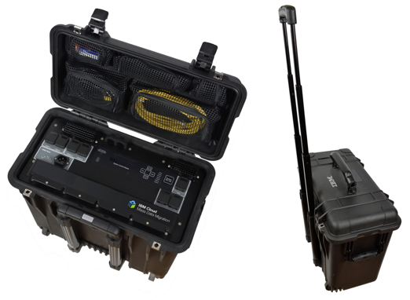

---

copyright:
  years: 2014, 2019
lastupdated: "2018-05-11"

keywords: 

subcollection: Db2onCloud

---

<!-- Attribute definitions --> 
{:external: target="_blank" .external}
{:shortdesc: .shortdesc}
{:codeblock: .codeblock}
{:screen: .screen}
{:tip: .tip}
{:important: .important}
{:note: .note}
{:deprecated: .deprecated}
{:pre: .pre}

# 將資料移轉至 IBM Cloud
{: #migration}

您可以從位於本端網路的定界格式資料檔案（CSV 或 TXT），或物件儲存庫（Amazon S3 或 IBM Cloud Object Storage）中的資料檔案，將資料載入到 {{site.data.keyword.Db2_on_Cloud_long}}。您甚至可以從內部部署系統移轉資料。
{: shortdesc}

## 從物件儲存庫載入資料
{: #cos}

若要從 Amazon S3 載入資料，請選取下列一種方法：
  * {{site.data.keyword.Db2_on_Cloud_short}} Web 主控台。**載入 > Amazon S3**。 
  * 直接從外部表格。以下是範例 SQL 陳述式：

    ```
      INSERT INTO <table-name> SELECT * FROM EXTERNAL '<mys3file.txt>' USING
        (CCSID 1208 s3('s3.amazonaws.com', 
        '<S3-access-key-ID>',
        '<S3-secret-access-key>', 
        '<my_bucket>'
           )
        )      
    ```

若要直接使用外部表格從 IBM Cloud Object Storage 載入資料，以下是範例 SQL 陳述式：

```
INSERT INTO <table-name> SELECT * FROM EXTERNAL '<mys3file.txt>' USING
  (CCSID 1208 s3('s3-api.us-geo.objectstorage.softlayer.net', 
  '<S3-access-key-ID>',
  '<S3-secret-access-key>', 
  '<my_bucket>'
     )
  )      
```

若為 IBM Cloud Object Storage，若要在建立新的服務認證時建立 HMAC 認證，請在*新增線型配置參數*欄位中指定 {"HMAC:true"}。
{: note}

## 從內部部署系統移轉資料
{: #onprem}

若要從內部部署系統移轉資料，請視您的資料集大小，選擇下列其中一種方法：
* 少於 25 TB 的資料：[IBM Lift CLI](#lift)
* 25 TB 以上的資料：[IBM Cloud Mass Data Migration](#mdms)

### Lift CLI
{: #lift}

Lift CLI 是一個應用程式，您可以免費用來將資料從表 1 列出的各種資料來源移轉至 {{site.data.keyword.Bluemix_notm}}。 

|IBM Cloud 上的目標資料庫|資料來源|
|------------------------------|-------------|
| {{site.data.keyword.Db2_on_Cloud_long_notm}}   | IBM Db2 |
|                              | Oracle 資料庫|
|                              | Microsoft SQL Server |
|                              | CSV 檔案格式|
{: caption="表 1. 移轉資料來源" caption-side="top"}

若要下載並安裝 Lift CLI，請參閱：[Download Lift CLI](https://www.lift-cli.cloud.ibm.com/#download){:external}。

如需使用 Lift CLI 將資料移轉至 {{site.data.keyword.Bluemix_notm}} 的逐步指示，請參閱：[Migrate data to {{site.data.keyword.Db2_on_Cloud_long_notm}}](https://www.lift-cli.cloud.ibm.com/#docs){:external}。

### IBM Cloud Mass Data Migration
{: #mdms}

這是一種快速、簡單且安全的方式，可實際將 TB 到 PB 的資料傳送到 {{site.data.keyword.Bluemix_notm}}。Mass Data Migration 是行動儲存裝置，具有 120 TB 的可用儲存空間容量，可加速將資料移到 {{site.data.keyword.Bluemix_notm}}。克服常見的傳輸挑戰，例如高成本、冗長的傳輸時間，以及安全顧慮 - 全都只需要單一服務。

{: caption="圖 1. Mass Data Migration 裝置的視圖" caption-side="bottom"}

如需 Mass Data Migration 裝置的相關資訊，請參閱：[入門指導教學](/docs/infrastructure/mass-data-migration?topic=mass-data-migration-getting-started-tutorial#getting-started-with-ibm-cloud-mass-data-migration){:external}。

